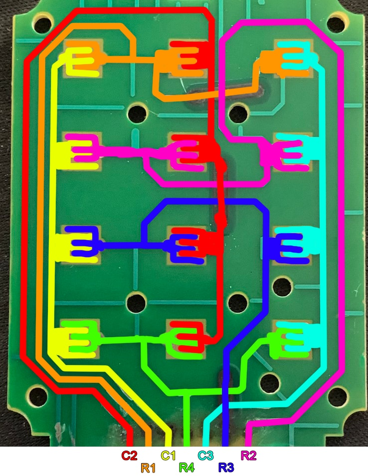
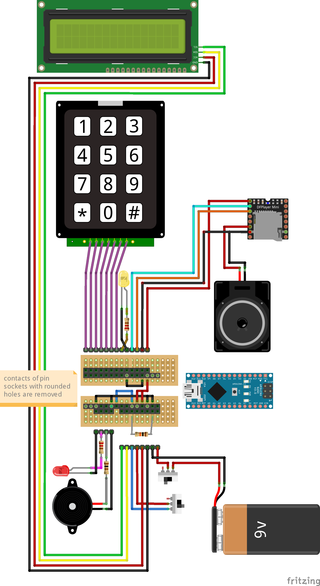

# Counter-Strike Bomb Prop Arduino Library
This is the library which handles the behaviour of the Counter-Strike Bomb Prop. Just install this library in your 
Arduino IDE and load the example sketch.

[Here you can see how I build it](https://youtu.be/Wk2TkWnkzZE)

# Components needed
- 16x1 Display with I2C Module
- Keypad (preferably a 4x3 with white keys)
- Passive buzzer
- DFPlayerMini MP3 module
- Micro SD card
- Speaker
- Red and a yellow LED
- Switch
- (Power button)
- Two 220 Ohm resistors for the LEDs
- 100 Ohm resistor for the buzzer
- 10k Ohm resistor for the switch
- Arduino Nano (or any other Arduino with enough pins)
- A PCB, some wires, an old 9V Battery, cardboard, packing paper, a printer, a 3D printer or a cover for the switch and a lot of patience

# Keypad from Aliexpress
I bought the keypad from aliexpress but couldn't find the pinout so I had to figure it out myself. 

| Pin Arduino | Pin keypad | C/R on Keypad |
|-------------|------------|---------------|
|  6          | 1          | C2            |
|  7          | 2          | R1            |
|  8          | 3          | C1            |
|  9          | 4          | R4            |
| 10          | 5          | C3            |
| 11          | 6          | R3            |
| 12          | 7          | R2            |

# Wiring

