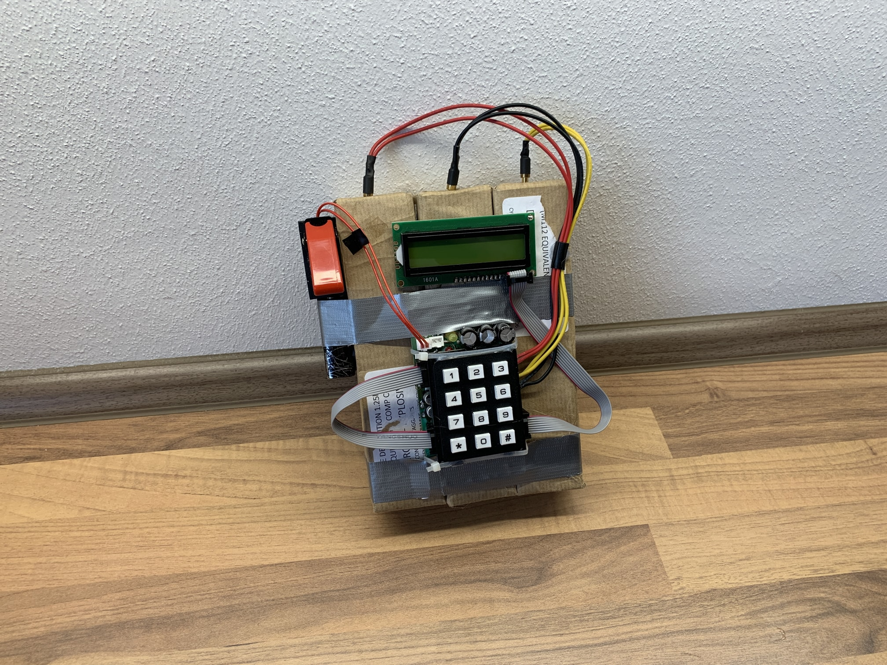
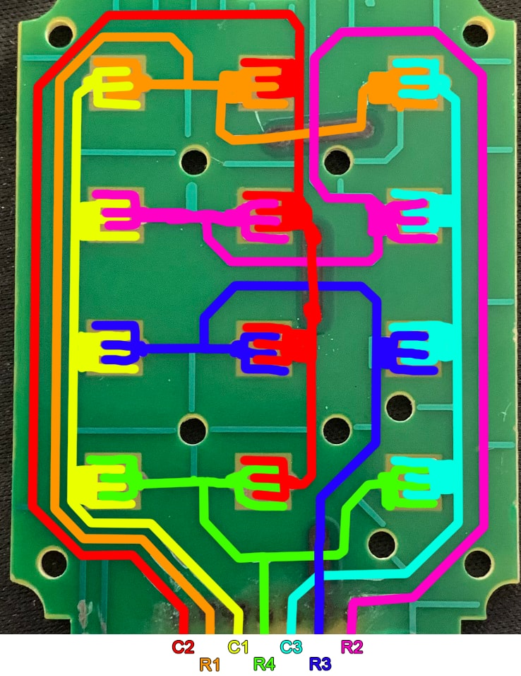
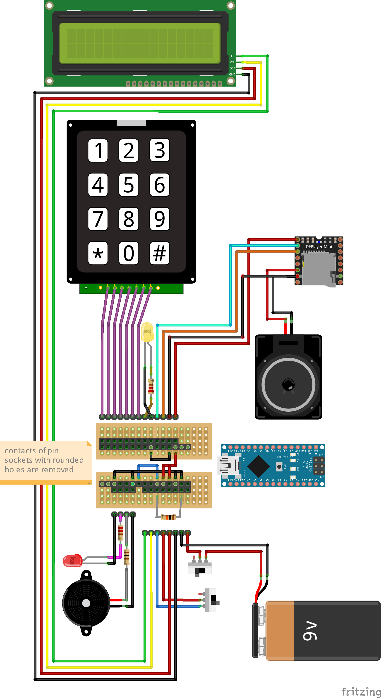

# Counter-Strike Bomb Prop Arduino Library
This is the library which handles the behaviour of the Counter-Strike Bomb Prop. Just install this library in your 
Arduino IDE and load the example sketch.

[Here you can see how I build it](https://youtu.be/Wk2TkWnkzZE)

# Components needed
- 16x1 Display with I2C Module
- Keypad (preferably a 4x3 with white keys)
- Passive buzzer
- DFPlayerMini MP3 module
- Micro SD card
- Speaker
- Red and a yellow LED
- Switch
- (Power button)
- Two 220 Ohm resistors for the LEDs
- 100 Ohm resistor for the buzzer
- 10k Ohm resistor for the switch
- Arduino Nano (or any other Arduino with enough pins)
- A PCB, some wires, an old 9V Battery, cardboard, packing paper, a printer, a 3D printer or a cover for the switch and a lot of patience

# Keypad from Aliexpress
I bought the keypad from aliexpress but couldn't find the pinout so I had to figure it out myself. 

| Pin Arduino | Pin keypad | C/R on Keypad |
|-------------|------------|---------------|
|  6          | 1          | C2            |
|  7          | 2          | R1            |
|  8          | 3          | C1            |
|  9          | 4          | R4            |
| 10          | 5          | C3            |
| 11          | 6          | R3            |
| 12          | 7          | R2            |

# Wiring

# Audio tracks
I can't upload the audio tracks due to potential copyright reasons. You can extract them from the game yourself. Here is a small tutorial: https://www.youtube.com/watch?v=YFKf5walh84

Here is a list with the description of the audio files:

| Name in .ino                     | ID in .ino | Description   |
|----------------------------------|------------|---------------|
|  mp3SoundIdInit                  | 1          | when the switch is toggled            |
|  mp3SoundIdRadioBombPlanted      | 2          | when code is entered completely            |
|  mp3SoundIdRadioBombTickingDown  | 3          | plays some seconds before explosion            |
|  mp3SoundIdBeforeExplosion       | 4          | high pitch sound right before detonation            |
| mp3SoundIdExplosionTerWin        | 5          | actual explosion sound            |
| mp3SoundIdDisarmStart            | 6          | defuse begin sound            |
| mp3SoundIdBombDefusedCTWin       | 7          | defuse finished sound            |
| mp3SoundIdSilence                | 8          | silence, which plays between other sounds (it's faster to switch tracks than to start a new one. just put a silent audio track of some minutes here)            |

### mp3SoundIdSilence.
Some people asked what the **mp3SoundIdSilence** is for. This is just an audio track with silence for about 10 minutes. I generated it with the tool Audacity. Theoretically you could also put a one hour silence there but I wouldn't do it less than 2-3 minutes.

The mp3SoundIdSilence track is always played between the other sounds. I noticed that the timing is more accurate when doing it like this because the play() Method of DFRobotDFPlayerMini behaves a bit weird here:
When you call DFRobotDFPlayerMini->play(fileNumber) it looks for the file on the SD card and plays it. However if nothing is played at the moment it takes longer to start the playback than if some other sound is played right now and it switches to the new soundfile.

Think of it like this:

This is when you have no silence inbetween:

You see the free space between the sounds? This is bad and causes delay.

This is when the silence is too short (some seconds), so that it finishes before other sounds are started:

You see, you still got space between the sounds where no sound is played. That's always bad.

You want to achieve this:

When the silence is long enough, it always fills the gaps -> good timing
